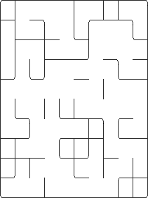
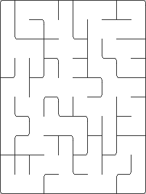

# Structure Union-Find et labyrinthes

Le but de ce TP est d'aborder le problème de l'Union-Find, et la structure de
données associée, et de l'appliquer pour la création de labyrinthes.

## Union-Find

Le problème de l'union-find est de gérer des ensembles disjoints d'objets : un
objet ne peut pas appartenir à deux ensembles en même temps. Initialement, tous
les objets sont dans leur propre ensemble, qui ne contient qu'eux. Il est
ensuite proposé deux opérations :

* l'*union* permet de joindre deux ensembles ;
* la *recherche* permet de déterminer si deux objets sont dans le même ensemble.

## Application à la création de labyrinthe

### Un labyrinthe intéressant

Ce TP vous propose d'appliquer la notion d'union find à la création de
labyrinthes. Cette création de labyrinthes se base sur le principe suivant :

* le labyrinthe est créé sur une grille carrée ;
* au début chaque case de la grille est entourée de murs ;
* petit à petit des murs sont abattus pour créer le labyrinthe.

En n'appliquant que ce principe, il est peu probable que le labyrinthe
obtenu soit intéressant. Tout d'abord, si le nombre de murs abbatus n'est pas grand,
il est peu probable que l'entrée et la sortie du labyrinthe soient accessibles
par un chemin. Ensuite ce procédé va vider le labyrinthe de ses murs sans créer
les recoins tortueux qui rendent les labyrinthes intéressants.



Pour obtenir un résultat plus intéressant, nous allons donc rajouter les deux
contraintes suivantes :

* depuis toute case, il est possible d'aller à toute autre case ;
* il n'y a qu'un seul chemin possible pour aller d'une case à une autre.

Les labyrinthes ainsi obtenus deviennent plus intéressants.



C'est pour mettre en place ces contraintes que l'Union-Find devient utile.

### Lien entre Union-Find et labyrinthes

Le principe est de dire que deux cases sont dans le même ensemble s'il existe un
chemin pour aller de l'une à l'autre dans le labyrinthe. Initialement, toutes
les cases sont entourées de murs, et donc chaque case est dans son propre
ensemble qui ne contient qu'elle.

Abattre le mur entre les cases $`a`$ et $`b`$ permet de créer un chemin entre ces
deux cases. Ainsi, pour s'assurer de ne jamais créer plus d'un chemin pour
aller d'une case à une autre, il suffit de ne jamais abattre de mur séparant des
cases qui sont déjà reliées par un chemin. On utilisera donc la *recherche* pour
déterminer si deux cases sont reliées par un chemin ou non.

En créant un chemin entre la case $`a`$ et la case $`b`$, on crée en réalité des
chemins entre toutes les cases qu'on pouvait atteindre depuis $`a`$ et toutes les
cases qu'on pouvait atteindre depuis $`b`$. On réalise donc l'*union* de
l'ensemble contenant $`a`$ et de l'ensemble contenant $`b`$.

## Implémentation

Ce dépôt contient un code de base pour gérer les grilles les afficher, abattre
et monter des murs. Il vous reste donc à rajouter des fichiers pour la structure
d'Union-Find et tout ce que vous trouvez utile, et à compléter le constructeur
de la classe `Labyrinthe` pour abattre des murs et créer un labyrinthe
intéressant.

### Union-Find

#### Arbres

Le principe de l'Union-Find est fondé sur des arbres, mais contrairement aux
arbres binaires que vous avez déjà manipulés, ces arbres stockent les liens de
parenté de bas en haut : chaque nœud connaît son *parent*. Par convention, le
parent de la racine de l'arbre est lui-même. Chaque arbre correspond à un
ensemble disjoint. Initialement, chaque élément est donc la racine de son propre
arbre, qui ne contient que lui.


Dans l'exemple ci dessus, l'Union-Find contient 4 ensembles, $`0`$ est l'enfant de
$`1`$, $`1`$ est la racine de son arbre.

Du point de vue de l'implémentation, le plus simple est d'identifier les $`n`$
objets par les entiers de $`[0,n-1]`$. Un tableau `tab` d'entiers de taille $`n`$
permet de stocker dans la case $`i`$ le numéro du parent de la case $`i`$. Dans
l'exemple précédent, nous aurions donc le tableau

```
[1, 1, 1, 4, 4, 4, 5, 8, 8, 9]
```

#### Recherche

Chaque ensemble est identifié par la racine de l'arbre qui le représente. La
recherche consiste donc à suivre la chaîne de parents d'un nœud jusqu'à
atteindre la racine de l'arbre. Pour déterminer si deux nœuds sont dans le même
ensemble, on regarde si les racines de leurs arbres sont identiques.

#### Union

Pour unir deux ensembles, il suffit de s'assurer que deux arbres initialement
distincts finissent avec la même racine. Il suffit donc de faire en sorte que le
parent de l'une des deux racines devienne l'autre racine.

Dans l'exemple précédent la fusion des deux premiers arbres donnerait donc l'un
des deux arbres suivants


Ce qui revient à renseigner 4 comme parent de 1

```
[1, 4, 1, 4, 4, 4, 5, ...]
```

ou à renseigner 1 comme parent de 4

```
[1, 1, 1, 4, 1, 4, 5, ...]
```

### Mise en place pour les labyrinthes

Muni·e de cette base pour l'Union-Find, il est désormais possible de l'utiliser
pour nos labyrinthes.

#### Mélange des murs

Votre labyrinthe est initialisé avec tous les murs montés. Pour que les
labyrinthes soient intéressants, il est nécessaire d'essayer d'abattre
l'ensemble des murs dans un ordre aléatoire. La bonne solution consiste à créer
une petite structure de votre choix pour représenter un mur entre deux cases, et
de stocker dans un tableau tous les murs possibles pour tout le labyrinthe. Vous
pouvez ensuite mélanger ce tableau en utilisant l'algorithme vu en cours, ou les
fonctionnalités de la librairie standard.

Une fois le tableau mélangé, vous pouvez le parcourir linéairement, et essayer
d'abattre chacun des murs qu'il contient. Après un passage, il n'est plus
possible d'abattre le moindre mur, et le labyrinthe respecte les contraintes.

#### Utilisation de l'Union-Find

Pour utiliser votre Union-Find, vous pouvez numéroter implicitement toutes les
cases de la grille en disant que la case à la ligne $`l`$ et la colonne $`c`$ est
associée au numéro $`l \times \mathrm{largeur} + c`$.

À chaque mur traité, récupérez les racines des arbres Union-Find des cases de
part et d'autre. Si les racines sont les mêmes, les cases sont déjà reliées par
un chemin, et le mur doit rester en place, sinon vous pouvez l'abattre, et
fusionner les ensembles des deux cases.

### Optimisation de l'Union-Find

L'implémentation initiale de l'Union-Find proposée peut être coûteuse en terme
de complexité. Dans le pire des cas, les fusions sont réalisées dans un ordre
tel que les arbres sont en réalité des sortes de listes chaînées, qu'il faut
parcourir d'un bout à l'autre pour en trouver la racine. La complexité dans le
pire des cas pour une recherche est donc linéaire, et la fusion nécessitant de
trouver les racines des deux arbres a la même complexité. Ces complexités
peuvent être nettement améliorées grâce à deux idées simples à mettre en œuvre.

#### Compression de chemin

Lorsque vous cherchez la racine d'un arbre, vous partez d'un nœud et sautez de
nœud en nœud pour la trouver. La compression de chemin fait en sorte qu'une fois
la racine trouvée, tous les nœuds sur le chemin changent de parent pour prendre
directement la racine pour parente. Cette optimisation est particulièrement
facile dans le cadre d'une implémentation récursive de la recherche de racine.
Dans l'image ci-dessous, une recherche de racine sur le noeud 5 va modifier les
parents de 5 et 4 pour qu'ils se placent directement sous 1.


#### Minimisation des hauteurs

La complexité d'une recherche dans le pire cas est la hauteur de l'arbre dans
laquelle elle est lancée. Lors de l'union de deux ensembles, il est possible
d'essayer de faire en sorte de n'augmenter les hauteurs des arbres que le moins
possible. Si les deux arbres sont de hauteurs différentes, en spécifiant la
racine de l'arbre le plus profond comme parente de la racine de l'arbre le moins
profond, la hauteur de l'arbre final est la même que celle de l'arbre le plus
profond. Ce n'est donc que lorsqu'on fusionne deux arbres de mêmes hauteurs
que nous obtenons un arbre de hauteur plus importante.

La compression de chemin modifie la hauteur des arbres. Il est ainsi
difficile d'avoir la valeur exacte de leur hauteur. On se contente donc d'une
approximation, en faisant comme s'il n'y avait jamais eu de compression de
chemin. Cette approximation est donc toujours pire que la réalité.

Pour stocker les hauteurs, il vous suffit d'ajouter un tableau qui stocke pour
chaque nœud une hauteur. Initialement toutes les hauteurs sont à 1. Lors
d'une fusion, seules les hauteurs des racines sont importantes. Les
hauteurs des nœuds ne restent donc utiles que tant qu'ils sont la racine de
leur arbre. Dès qu'ils se retrouvent sous un parent, il n'est plus nécessaire de
mettre à jour leur hauteur.

#### Complexité finale

Avec ces deux optimisations, la compression de chemin devient beaucoup plus
efficace lorsque la complexité est examinée de façon amortie sur un grand nombre
d'opérations. Les deux opérations de recherche et d'union peuvent ainsi être
réalisées avec une complexité de l'ordre de l'inverse de la fonction
d'Ackermann. En pratique, pour des valeurs de n raisonnables, l'inverse de la
fonction d'Ackermann ne dépasse pas 5, donc cette complexité est très proche
d'une complexité constante.
